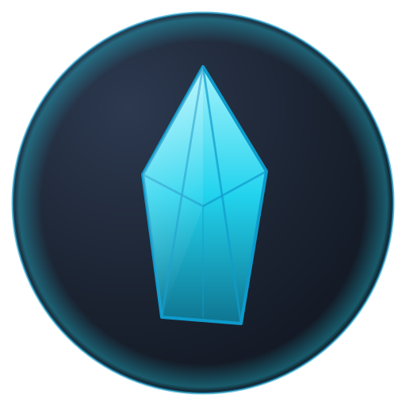
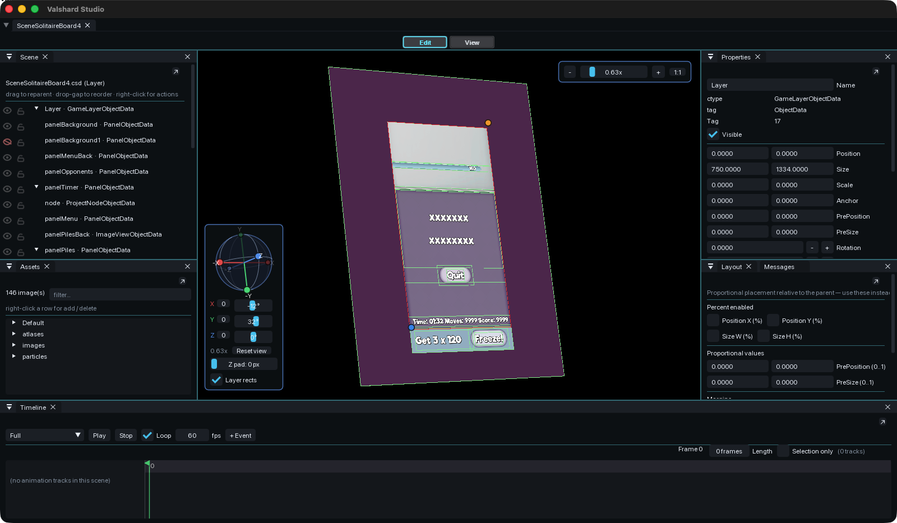

<p align="center">
  
</p>

# Walshard Studio

*AI-first scene editor for cocos2d-x and axmol games.*

<p align="center">
  
</p>

## Built for agents

Every editor action is exposed as a scriptable command over a TCP
line protocol on port 9876 (override with `OCS_INSPECT_PORT`). An
LLM agent — Claude, GPT, Gemini, a local model — can drive the full
editor workflow without a human in the loop.

**MCP bridge included.** A Python Model Context Protocol server lives
in [`mcp-server/`](mcp-server/) and exposes 26 typed tools over stdio.
Wire it to Claude Code in one line:

```bash
cd mcp-server && pip install -e .
claude mcp add walshard -- walshard-mcp
```

Or drop it into Claude Desktop's `claude_desktop_config.json` —
[full setup in the bridge's README](mcp-server/README.md).

| Capability | Commands |
|---|---|
| Inspect scene | `describe`, `tree`, `tree-since`, `selected`, `listbindings` |
| Mutate scene | `setattr`, `setcolor`, `setfile`, `setlabel`, `setvisible`, `setbgcolor`, `addchild`, `delete`, `addbinding`, `delbinding` |
| Visual feedback | `screenshot`, `screenshot-canvas`, `preview`, `preview-visual` |
| Validate | `validate` (catch schema errors before commit) |
| Bulk ops | `apply-to-scenes` (replay a script across every scene matching a glob) |
| Code gen | `gen-controller` (emit paired `.h/.cpp` with stubs for every binding) |
| Asset pipeline | `svg-rasterize`, `svg-bake`, `download` |
| Live observation | `watch on` (subscribe to `EVENT selection/dirty/mode/opened/saved/exported`) |
| Auth gate | `auth <token>` (set `OCS_INSPECT_TOKEN` to require it) |

Every mutation goes through the same undo stack a human user works
with — an agent's mistake is one `undo` away from being unmade.

Open-source visual editor for `.csd` / `.csb` scene files used by
cocos2d-x and axmol game engines. Built on
[axmol](https://github.com/axmolengine/axmol) + ImGui.

Cocos Studio was discontinued by Chukong in 2016. Walshard Studio
replaces the 80% editor workflow — open a scene, tweak node properties
live on a real axmol canvas, save, regenerate `.csb` — with a modern,
scriptable, agent-driven editor.

## Build

Requires **CMake 3.22+**, **Xcode 14+**, and a local axmol checkout.

```bash
cmake -S . -B build.axmol -G Xcode -DAX_ROOT=/path/to/axmol
cmake --build build.axmol --config Debug
```

Or open `build.axmol/Walshard.xcodeproj` in Xcode and ⌘R.

## Run

```bash
build.axmol/bin/Walshard/Debug/Walshard.app/Contents/MacOS/Walshard \
    path/to/scene.csd [more.csd …]
```

Each `.csd` opens as a tab. Drag a tab outside the window to fork a
new process; drag onto another Walshard window's tab bar to merge.
View → Detach Panel pops a panel into its own OS window.

## Project layout

```
app/                       # Host app — main(), tabs, IPC, native menu
  └── UILayoutEditor/      # Editor-only library (not shipped to games)
      ├── CsdModel         # Lossless pugixml parser/serializer
      ├── Editor           # State + render loop
      └── panels/          # Scene tree, Properties, Assets, Layout, Messages
extensions/OCSExtension/   # Runtime library — game projects link this
mcp-server/                # Python MCP bridge — drive editor from any MCP client
proj.ios_mac/mac/main.cpp  # axmol Mac entry point
```

## License

Three-license repo. Full text in `LICENSE`.

**Mission: Walshard Studio is intended to remain a free-of-charge
tool in perpetuity. Nobody may monetize the editor itself except the
original author (Vlad Cioaba).** Forks may not be sold, hosted for a
fee, bundled into paid products, or otherwise commercially exploited.
See "Reservation of Commercial Rights" in `LICENSE`.

* **Editor source** (`app/`, `tools/`, build scripts) — **PolyForm
  Noncommercial 1.0.0** + Reservation of Commercial Rights. Free for
  hobby/study/personal/educational/charitable use. Forks must keep
  upstream attribution.
* **Runtime library** (`extensions/OCSExtension/`) — **MIT**. The
  small library that game projects link to load `.csb` scenes at
  runtime. Games shipping this library can be sold commercially
  without restriction — this is the supported way to commercialize
  your *game*, not the editor.
* **Files produced by the editor** (`.csb`, sidecar JSON, baked PNGs,
  generated headers) — yours, free to use, modify, sell, sublicense
  without obligation. See `LICENSE-ASSETS.md`.

By forking, you grant the original licensor (Vlad Cioaba) and any
successor maintainer of the upstream repository a license to
integrate your modifications back under the same license that already
covers each file. See "Upstream Integration Grant" in `LICENSE`.

"Cocos", "Cocos2d", "Cocos2d-x", and "Cocos Studio" are trademarks of
their respective owners. Walshard Studio is an independent project,
not affiliated with or endorsed by Chukong Technologies, Xiamen Yaji
Software, or the axmol project. See the "Trademark Notice" section
in `LICENSE`.

## Contributing

**PRs welcome.** This project is built by one person right now and
benefits enormously from outside contributors:

- **Building a cocos2d-x or axmol game?** If a missing feature or a
  rough edge in the editor is blocking your workflow, open an issue
  describing the use case — or skip straight to a PR.
- **Have an improvement idea?** Custom node types, RPC commands,
  panel layouts, sidecar formats, asset pipelines — all in scope.
- **Found a bug?** Issue or PR, either works. Repro steps + your
  `.csd` reproducer help.
- **Working on a fork?** The `LICENSE` "Upstream Integration Grant"
  means any patch you publish can be pulled back into this repo
  under the same license terms — no separate CLA needed.

How to contribute:

1. Fork on GitHub.
2. Branch off `main`. Keep commits scoped (one logical change each).
3. Run the macOS build (`cmake --build build.axmol --config Debug`)
   and confirm it stays green. If you touched Linux/Windows code
   paths, ping the maintainer to verify CI; cross-platform changes
   are reviewed extra carefully.
4. Open a PR. Brief description, screenshot if it's UI, and a note
   on what you tested.

The editor itself remains under PolyForm Noncommercial — nobody but
the original author can monetize the *editor*. Games **you build**
with the editor are a different matter entirely: the runtime library
(`extensions/OCSExtension/`) is MIT, so any game you ship with it
can be **sold commercially without restriction or royalty**, just
like any other middleware-built game. See the License section for
the full breakdown — none of it gates contributions, and none of it
touches games made with the tool.

## Status

Working: tabs + tear-off + cross-process merge, multi-window detached
panels with shared-document sync, drag-band selection, edit overlay
(move/resize/rotate handles), per-element lock (with self-only via
Ctrl-click), Cocos Studio `.csd`/`.csb` attribute round-trip, autosave
sidecars on every edit.

---

*Walshard Studio is built by Vlad Cioaba. The name carries the line
forward — mosaic shattered, shards remain.*
